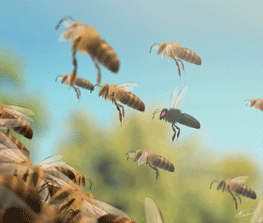
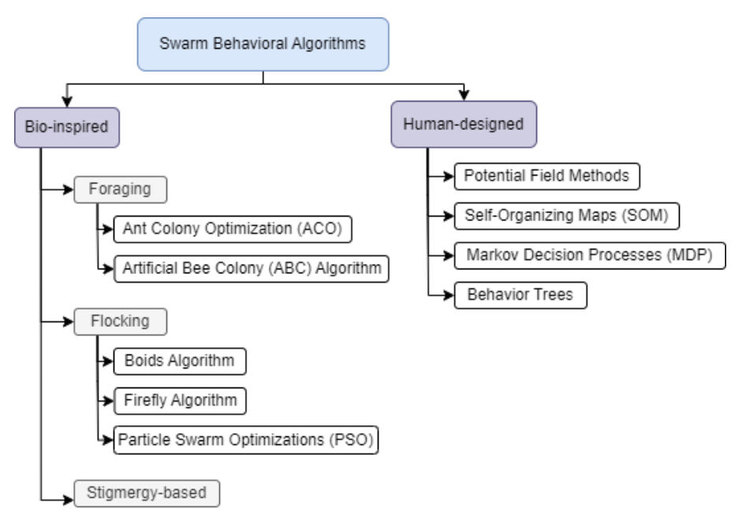
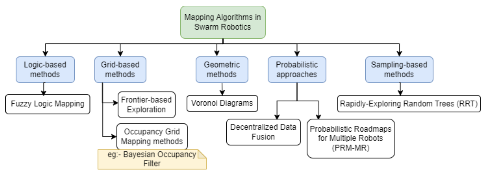
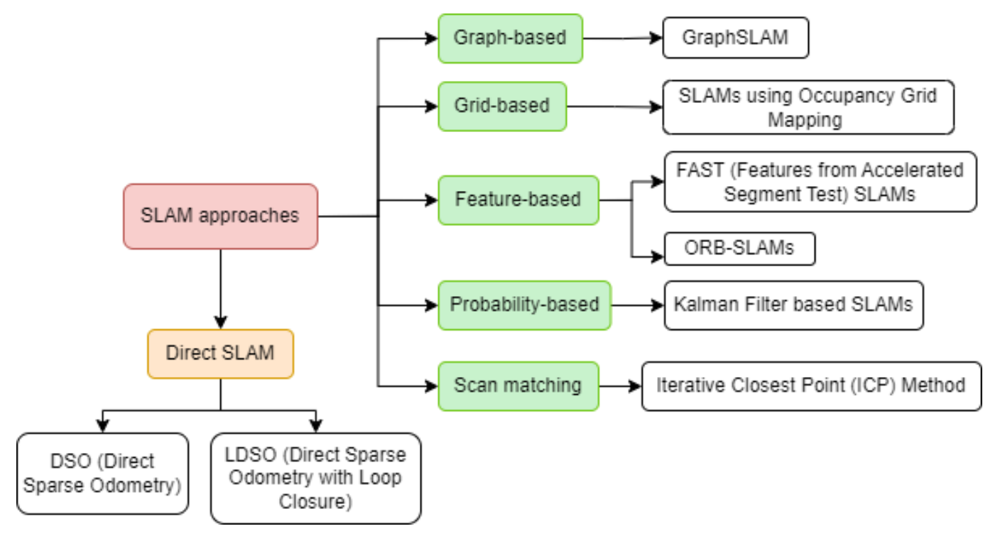
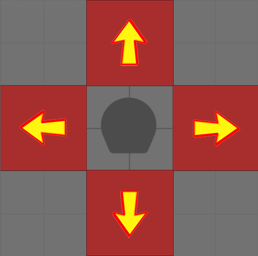
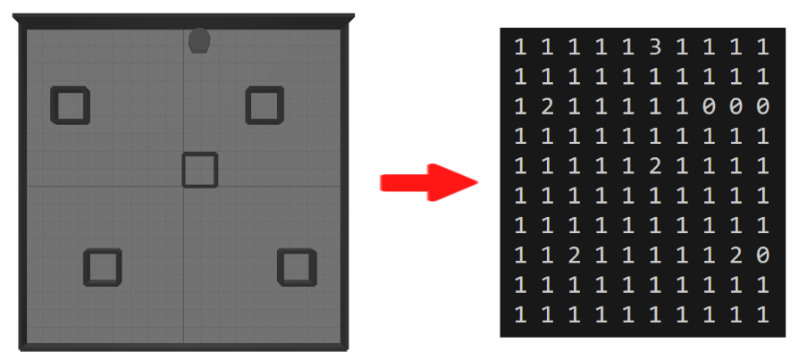
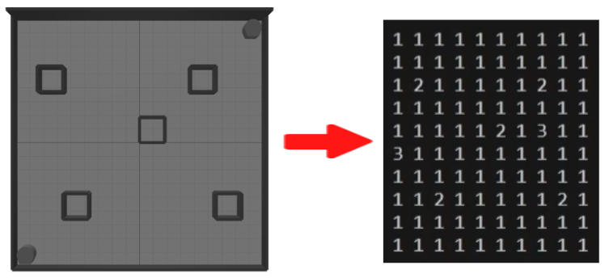
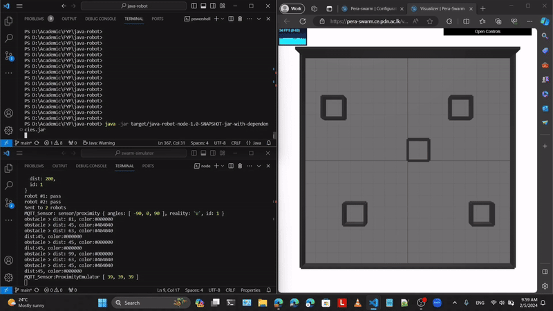

[comment]: # "This is the standard layout for the project, but you can clean this and use your own template"

# PeraSwarm: Simultaneous Localization and Mapping in Mixed Reality Environment

#### Team

- E/18/077, N.S. Dharmarathne, [email](mailto:e18077@eng.pdn.ac.lk)
- E/18/150, H.M.Y.S. Jayarathna, [email](mailto:e18150@eng.pdn.ac.lk)
- E/18/227, D.H. Mudalige, [email](mailto:e18227@eng.pdn.ac.lk)

#### Supervisors

- Prof. Roshan G. Ragel, [email](mailto:roshanr@eng.pdn.ac.lk)
- Dr. Isuru Nawinne, [email](mailto:isurunawinne@eng.pdn.ac.lk)
- Mr. Nuwan Jaliyagoda, [email](mailto:nuwanjaliyagoda@eng.pdn.ac.lk)

#### Table of content

1. [Abstract](#abstract)
2. [Introduction](#introduction)
3. [Related works](#related-works)
4. [Experiment Setup and Implementation](#experiment-setup-and-implementation)
5. [Conclusion](#conclusion)
6. [Publications](#publications)
7. [Links](#links)

<!-- 3. [Methodology](#methodology)
4. [Experiment Setup and Implementation](#experiment-setup-and-implementation)
5. [Results and Analysis](#results-and-analysis)
6. [Conclusion](#conclusion)
7. [Publications](#publications)
8. [Links](#links) -->

---

<!-- 
DELETE THIS SAMPLE before publishing to GitHub Pages !!!
This is a sample image, to show how to add images to your page. To learn more options, please refer [this](https://projects.ce.pdn.ac.lk/docs/faq/how-to-add-an-image/)
 
-->

## Abstract
This paper explores the captivating field of swarm robotics, where multiple robots collaborate to achieve tasks in decentralized and distributed manner. Inspired by natural swarm behaviors, such as those observed in ants and bees, swarm robotics aims to analyze emergent behaviors within robot swarms, including aggregation, dispersion, and collective movement. The focus here is on the exploration behavior of swarm robotics in unknown environments. While swarm robotics offers increased efficiency, reliability, and cost-effectiveness, implementing distributed exploration poses challenges in coordination, communication, decision-making, and fault tolerance. Nonetheless, advancements in robotics and artificial intelligence pave the way for overcoming these challenges, leading to more efficient and robust exploration missions.

Index Terms — Swarm robotics, Collaborative mapping, Swarm intelligence

## Introduction
Swarm robotics is a fascinating field of robotics that involves multiple robots working together to achieve tasks in a decentralized and distributed manner. It is inspired by the collective behavior observed in natural swarms, such as colonies of ants and hives of bees, where individual entities work together towards a common goal. 

 

Fig. Natural swarms (Ants, Bees)

The primary objective of swarm robotics is to investigate and analyze the emergent collaborative and competitive behaviors within a swarm of robots. Over the past decades, researchers have delved into various emergent behaviors, including aggregation, dispersion, pattern formation, collective movement and task allocation. Each of these behaviors offers unique insights into how individual robots can work together to achieve complex tasks without centralized control or leadership. Here, we will specifically concentrate on the exploration behavior of swarm robotics in unknown environments.

Autonomous mobile robots, which have been at the forefront of scientific research for numerous years, are renowned for their wide-ranging applications. These applications often require a pre-existing map of the environment, a requirement that is integral to the successful operation of these robots. The applications are diverse and span several fields, including search and rescue missions, cleaning tasks, and systems for intrusion detection or fault identification. In the context of search and rescue missions, for instance, these robots can navigate through hazardous environments, reaching areas that are inaccessible or too dangerous for humans. For cleaning tasks, autonomous robots can efficiently cover large areas, ensuring every nook and corner is attended to. In security systems, these robots can patrol and monitor specified areas, detecting any anomalies or intrusions.

A map exploration system allows the robot to autonomously create a representation of its surroundings. It’s like giving the robot a sense of ‘sight’, enabling it to understand and navigate its surroundings. However, this is not a trivial task. It can be time-intensive, especially for a single robot, particularly in large disaster areas with complex terrains. The challenge is compounded by the dynamic nature of these environments, where obstacles can appear or disappear, and paths can open or close. Therefore, the development of efficient mapping strategies is of utmost importance for the effective use of autonomous mobile robots. These strategies should enable the robots to quickly and accurately map their environment, identify obstacles, and plan the best path to their destination. They should also allow the robots to adapt to changes in the environment and recover from any errors or failures. 

In comparison to a single autonomous mobile robot, a group or swarm of these robots can offer a multitude of benefits in exploration tasks. These advantages include enhanced efficiency, increased reliability, and robustness. These benefits are achieved through some form of collaboration among the team members, a characteristic that is inherent to the concept of swarm robotics. Firstly, due to this collaborative approach, a swarm of robots can complete complex tasks more quickly than a single robot. This is a significant advantage, particularly for missions where time is of the essence. The swarm can cover more ground, gather more data, and complete tasks more quickly, making it an invaluable tool in these situations. Moreover, the redundancy of robots in a swarm provides added flexibility. This means that even if some robots malfunction or are unable to complete their tasks, the overall mission can still be completed. This is because other robots in the swarm can take over the tasks of the malfunctioning robots, ensuring the robustness of the system. This redundancy and flexibility are crucial in dynamic and unpredictable environments, where robots may face unforeseen challenges or obstacles. Lastly, each robot in a swarm doesn’t need to be as costly or sophisticated as a single robot performing the same task. This makes swarm robotics a more economical choice for many applications. Instead of investing in one highly sophisticated and expensive robot, organizations can invest in a swarm of simpler, more affordable robots. These robots, though individually less capable, can collectively achieve the same, if not better, results. This cost-effectiveness, combined with the other benefits of swarm robotics, makes it an attractive choice for a wide range of applications.

However, implementing this strategy in a distributed manner presents several challenges. One of the primary difficulties is the coordination and communication among the robots. Each robot needs to share its findings and current status with the rest of the swarm to ensure efficient exploration and avoid redundant efforts. This requires a robust and reliable communication system, which can be challenging to implement, especially in environments where communication signals may be weak or disrupted. Another challenge is the decision making process. In a distributed system, each robot needs to make decisions based on its local information and the information received from its peers. Designing an effective decision-making algorithm that can handle uncertainties and dynamically adapt to the changing environment is a complex task. This requires sophisticated algorithms for fault detection, isolation, and recovery.

  
  
Fig. Behavioral Algorithms related to Swarm Intelligence

## Related works
In the past few decades, there’s been a surge of interest in searching through different potentials of swarm robotics. In this session, we’ll take a deep dive into existing research to gain a clear picture of where this field stands today. Here, our major goal is to pinpoint areas that need more attention, spot emerging patterns, and highlight important theories.

Rothermich et al. reported about a swarm of simple robots to explore and map an unknown building. The paper discussed the general issues and questions of swarm robotics, such as when and how to use swarms, and how to evaluate their performance. The paper also described the methods and tools used for simulation and experimentation, and the algorithms developed for collaborative localization, task allocation, and mapping.

According to the SwarMap system, a swarm of robots collaboratively built with a shared grid stored in the cloud using Bayesian Filters. These robots exchanged their localization estimates and sent updates to the grid, resulting in enhanced localization and map quality compared to using odometry alone. The experiments also showed that larger swarm groups yield better maps due to improved cooperative localization. Despite, another methodology that allows each robot to update its belief about its position using only local information was formulated by the same set of people. Here, it involved a leader robot equipped with good localization capabilities, which would provide position estimates to the rest of the swarm. This leader robot guided the group by suggesting the direction to be followed, enabling the robots to cooperatively localize themselves using an approximate decentralized algorithm. They also maintained a group cohesion during navigation by collectively estimating their positions. The use of information from immediate neighbors allowed each robot to perform localization effectively and collective motion strategies played a crucial role in achieving accurate and reliable cooperative localization.

Zhang et al. used a fully decentralized approach with an occupancy grid map and four states to represent obstacles, unexplored areas, free spaces, and frontiers. The exploration strategy was based on frontiers, which were the boundaries between explored and unexplored areas. The robots were repeatedly detecting these frontiers and were moving towards them until there were no more frontiers, and consequently, no more unknown regions. At each time step, each robot broadcasted its own position and local map, integrating the information received from other robots into its local map.

  
  
Fig. Grid map environment

  
  
Fig. Overall schematic diagram

Abu-Aisheh et al. introduced the Atlas Algorithm, a novel approach for sparse swarm robot exploration and mapping. However, it may not be suitable for decentralized systems, as it was relied on a centralized controller to direct robots in systematic exploration. Atlas would ensure mapping completion even with just a single robot. This was achieved through a systematic exploration controlled by a central controller, which can direct robots to unexplored areas, focusing on frontier cells rather than frontier robots. This approach allowed the frontier to expand away from the starting point, with robots making circular movements to explore. In obstaclerich environments, the swarm can divide into subgroups for efficient navigation.

Atlas was evaluated against algorithms such as Ramaithithima, random walk, and ballistic walk. Here, metrics like exploration time, cost, efficiency, map completeness, and quality were used for comparison. Results demonstrated that, Atlas was superior in exploration speed and map completeness. Also, Atlas was having lower exploration cost and higher efficiency with compared to the alternatives. Overall, while Atlas presents a comprehensive exploration and mapping solution for centralized systems, our search continues for a decentralized approach that aligns with our objectives.

A system with comprehensive explanations on collaborative mapping and navigation algorithms was formulated by Arvanitakis et al. where each robot in the swarm was equipped with a limited field of view, a limited-range finder, and a magnetometer to infer its orientation. The robots were assigned fixed stationary targets. They initially explored towards their target areas and then were guided towards their targets. The robots exchanged their maps in a collaborative manner during the exploration.

Dieter et al. introduced a distributed, multi-robot mapping and exploration approach that can handle unknown initial locations in limited communicating environments. They were able to tackle the challenges of coordinating robots without knowledge of their relative locations, integrating their data into consistent maps. They introduced a decisionbase coordination technique to balance exploration and location verification, along with a Bayesian map merging technique for estimating map overlaps. Here, the robots were exploring unknown areas with verifying hypotheses, using a shared map that updates when robots detect each other.

Previous approaches mainly relied on random motion models, neglecting prior information in the map but Rogers et al. focused on the challenge of constructing an occupancy grid map in an unknown environment using a swarm of resource-constrained robots with limited sensing capabilities. The proposed strategy introduced a collaborative exploration approach, dividing the swarm into landmark robots and mapper robots, where the former guide the latter to promising areas to collect proximity measurements for map incorporation. The positions of the landmark robots were optimized to maximize new information while adhering to connectivity constraints, effectively decoupling the problem of directing the swarm from the mapping task. Extensive simulated experiments validated the performance, improves exploration efficiency and ensures that new information is maximized, leading to more effective mapping.

In addition to the above explained theories and algorithms and also to get better understanding on these subjects, the Figure 2 shows an overview of mapping algorithms in swarm robotics, categorized in a systematic way. When talking about other technologies related to robotics, Simultaneous Localization and Mapping (SLAM) can be considered as a pivotal element which can be used to create detailed maps of the surrounding while concurrently determining the robot’s position within them. Most of the SLAM based algorithms integrate data through sensor fusion, with diverse ranges such as cameras, LIDARs, or sonars, refining both the map and localization estimates over time. Widely used systems like Google’s Cartographer and ORB-SLAM exemplify the versatility of SLAM in navigating and mapping unknown environments with precision and robustness.

  
  
Fig. Some famous mapping algorithms in swarmrobotics 

Figure 3 shows current approaches in SLAM, like direct implementations of SLAM (specially, theories like odometry and loop closure) and some derivatives from previously mentioned algorithms (for example, occupancy grid approach for mapping inside SLAM). Despite, most of these approaches were primarily focused on non-swarm systems, which are limited in scalability, adaptability. On the other hand, Swarm SLAM can be considered as a promising approach that leverage the decentralized nature of robot swarms to achieve scalable, flexible, and fault-tolerant exploration and mapping. For example, when considering broader applications like in the agricultural domain, SLAM technology has been employed for precision farming, crop monitoring, and autonomous agricultural vehicles.

  
  
Fig. Simultaneous Localization and Mapping approaches

Collaborative SLAM (C-SLAM) also known as multi-robot SLAM (MRSLAM), a key extension from the foundational principles of swarm SLAM to heterogeneous robot teams which had been used in the recent researches to test selfdriving cars and multi-robot systems. Lajoie et al. survey provides valuable insights into the challenges and opportunities associated with collaborative mapping.

<!--
---

According to the SwarMap system, a swarm of
robots collaboratively built with a shared grid stored in the
cloud using Bayesian Filters. These robots exchanged their
localization estimates and sent updates to the grid, resulting
in enhanced localization and map quality compared to using
odometry alone. The experiments also showed that larger
swarm groups yield better maps due to improved cooperative
localization. Despite, another methodology that allows each
robot to update its belief about its position using only local
information was formulated by the same set of people.

Here, it involved a leader robot equipped with good
localization capabilities, which would provide position
estimates to the rest of the swarm. This leader robot guided
the group by suggesting the direction to be followed, enabling
the robots to cooperatively localize themselves using an
approximate decentralized algorithm. They also maintained a
group cohesion during navigation by collectively estimating
their positions. The use of information from immediate
neighbors allowed each robot to perform localization
effectively and collective motion strategies played a crucial
role in achieving accurate and reliable cooperative localization.

---

Zhang et al. used a fully decentralized approach with
an occupancy grid map and four states to represent obstacles,
unexplored areas, free spaces, and frontiers. The exploration strategy was based on frontiers, which were the boundaries
between explored and unexplored areas. The robots were
repeatedly detecting these frontiers and were moving towards
them until there were no more frontiers, and consequently,
no more unknown regions. At each time step, each robot
broadcasted its own position and local map, integrating the
information received from other robots into its local map.

  
  
Fig. Grid map environment

  
  
Fig. Overall schematic diagram

---

Abu-Aisheh et al. introduced a novel algorithm
for swarm robots to explore and map unknown areas
using a central controller and wireless communication. The
Atlas algorithm prioritized frontier cells, ensuring complete
exploration even with a single robot. Comparative simulations
demonstrated that Atlas would outperform other algorithms,
particularly for sparse swarms.

---

Rothermich et al. reported about a swarm of simple
robots to explore and map an unknown building. The paper
discussed the general issues and questions of swarm robotics,
such as when and how to use swarms, and how to evaluate
their performance. The paper also described the methods
and tools used for simulation and experimentation, and the
algorithms developed for collaborative localization, task
allocation, and mapping.

  
  
Fig. Occupancy grid mapping

  
  
Fig. Topological mapping

---

Dieter et al. introduced a distributed multi-robot
mapping and exploration approach that handles unknown
initial locations and limited communication. It combined
decision-theoretic coordination, particle filters for relative
location estimation, and constraint-based map merging. Here,
the robots were exploring unknown areas with verifying
hypotheses, using a shared map that updates when robots
detect each other or merge their maps.

---

Rogers et al. focused on the challenge of constructing an
occupancy grid map in an unknown environment using a
swarm of resource-constrained robots with limited sensing
capabilities. The proposed strategy introduced a collaborative
exploration approach, dividing the swarm into landmark
robots and mapper robots, where the former guide the latter to promising areas to collect proximity measurements for map incorporation. The positions of the landmark robots were optimized to maximize new information while adhering to connectivity constraints, effectively decoupling the problem of directing the swarm from the mapping task. Extensive simulated experiments validated the performance, improves exploration efficiency and ensures that new information is maximized, leading to more effective mapping.
-->

<!-- ## Methodology -->

## Experiment Setup and Implementation

Here, we present our progress on developing a multirobot mapping system using occupancy grid approach. We
tested mapping algorithms with virtual robots in our simulated
environment.
Each robot is constrained to move one step at a time in four
directions: North, East, South and West. These limitations play
a crucial role in our multi-robot mapping system, affecting
their exploration patterns and map coverage efficiency. Fig. 1
illustrates the restricted movement capabilities of our robots.

  
  
Fig. Robot movement constraints

We assume the robots operate in a planer workspace. To
represent the overall environment, we use a grid map. This
map is stored as a matrix, where each element corresponds
to a specific state within the environment. Here are the four
possible states:
(a) Unexplored area (0): Represents cells that have not yet
been explored.
(b) Free area (1): Represents explored free area.
(c) Obstacle (2): Indicates that a cell is obstructed or contains
an obstacle.
(d) Robot (3): Represents current position of the robot.
Refer to Fig. 2 for a visual representation of these states
with the testing environment we used. The matrix captures
this information, allowing the robots to navigate and make
decisions based on the environment’s characteristics.

  
  
Fig. Robot testing environment and grid map states

Each robot is equipped with a proximity sensor, enabling
it to sense and interact with its surrounding environment.
Furthermore, these robots possess the capability to synchronize
the contents of their local memory maps with other robots.
After each time step, subsequent to the update of cell information in its local memory, the robot broadcasts both its current
position and the local map.
In the initial phase of our project, we conducted tests
using two robots. We operated under the assumption that
we had precise knowledge of their starting positions and the
directions they were facing. This allowed us to successfully
manage intercommunication between the robots and integrate
the maps generated by each robot. This led to the creation
of a complete map within each robot. Fig. 3 illustrates the
testing environment we utilized, along with the map that was
generated within a few minutes of operation.

  
  
Fig. Testing environment and generated map for two robots

  
  
Demonstration

We evaluated the performance of our mapping algorithms
in terms of accuracy, completeness, and scalability.
We also took an approach to mapping with unknown initial
positions and heading directions.

## Conclusion
Swarm robotics can be considered as a core research topic in the scope of multi-agent systems in engineering that leverages the principles of self-organization, decentralized control, and collective intelligence to create adaptive and robust robotic systems capable of performing a wide range of tasks in complex and dynamic environments.

In SLAM-based multi-robot systems, research gaps include complex sensor usage, centralized mapping focus, limited realworld testing, scalability issues with increasing robot numbers, lack of robustness to dynamic environments, potential for sensor fusion techniques, exploration of decentralized communication protocols, and the need for standardized benchmark datasets. These gaps offer opportunities for exploring innovative solutions, advancing system capabilities, and fostering collaboration across disciplines.

Our proposed solutions to these research gaps include utilizing cost-effective robots equipped with simple sensors to streamline operations. Integrating data from various sensors enhances mapping and localization accuracy, optimizing system performance. Implementing decentralized systems with distributed mapping algorithms fosters collaboration among robots, improving overall mapping efficiency. These innovative approaches aim to address existing challenges and propel advancements in multi-robot system capabilities.

However, SLAM with swarm robotics is still a relatively new concept, lacking well-defined frameworks and results. It is believed that Swarm SLAM can be particularly advantageous in producing abstract maps and operating under time or cost constraints. Future directions and potential advancements in Swarm SLAM involve the development of advanced cooperative localization methods, integration of machine learning techniques for improved mapping and localization.

 
## Publications
<!--[//]: # "Note: Uncomment each once you uploaded the files to the repository" -->

1. [Semester 7 report](./Semester_7_report.pdf)
2. [Semester 7 slides](./Semester_7_slides.pdf)
<!-- 3. [Semester 8 report](./) -->
<!-- 4. [Semester 8 slides](./) -->
<!-- 5. Author 1, Author 2 and Author 3 "Research paper title" (2021). [PDF](./). -->

## Links

[//]: # ( NOTE: EDIT THIS LINKS WITH YOUR REPO DETAILS )

- [Project Repository](https://github.com/cepdnaclk/e18-4yp-PeraSwarm-Simultaneous-Localization-and-Mapping-in-Mixed-Reality-Environment)
- [Project Page](https://cepdnaclk.github.io/e18-4yp-PeraSwarm-Simultaneous-Localization-and-Mapping-in-Mixed-Reality-Environment/)
- [Pera Swarm - GitHub Organization](https://github.com/pera-swarm)
- [Pera Swarm - Website](https://pera-swarm.ce.pdn.ac.lk/)
- [Department of Computer Engineering](http://www.ce.pdn.ac.lk/)
- [University of Peradeniya](https://eng.pdn.ac.lk/)

[//]: # "Please refer this to learn more about Markdown syntax"
[//]: # "https://github.com/adam-p/markdown-here/wiki/Markdown-Cheatsheet"
