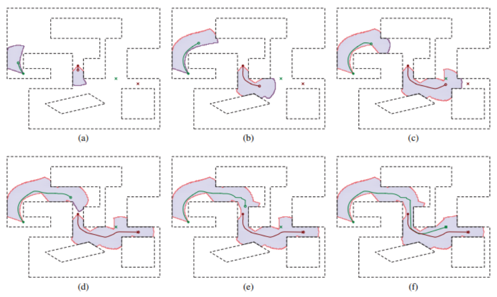

[comment]: # "This is the standard layout for the project, but you can clean this and use your own template"

# PeraSwarm: Simultaneous Localization and Mapping in Mixed Reality Environment

#### Team

- E/18/077, N.S. Dharmarathne, [email](mailto:e18077@eng.pdn.ac.lk)
- E/18/150, H.M.Y.S. Jayarathna, [email](mailto:e18150@eng.pdn.ac.lk)
- E/18/227, D.H. Mudalige, [email](mailto:e18227@eng.pdn.ac.lk)

#### Supervisors

- Prof. Roshan G. Ragel, [email](mailto:roshanr@eng.pdn.ac.lk)
- Dr. Isuru Nawinne, [email](mailto:isurunawinne@eng.pdn.ac.lk)
- Mr. Nuwan Jaliyagoda, [email](mailto:nuwanjaliyagoda@eng.pdn.ac.lk)

#### Table of content

1. [Abstract](#abstract)
2. [Related works](#related-works)
3. [Experiment Setup and Implementation](#experiment-setup-and-implementation)
4. [Results and Analysis](#results-and-analysis)
5. [Conclusion](#conclusion)
6. [Links](#links)

<!-- 3. [Methodology](#methodology)
4. [Experiment Setup and Implementation](#experiment-setup-and-implementation)
5. [Results and Analysis](#results-and-analysis)
6. [Conclusion](#conclusion)
7. [Publications](#publications)
8. [Links](#links) -->

---

<!-- 
DELETE THIS SAMPLE before publishing to GitHub Pages !!!
This is a sample image, to show how to add images to your page. To learn more options, please refer [this](https://projects.ce.pdn.ac.lk/docs/faq/how-to-add-an-image/)
 
-->

## Abstract
The research is focused more on mapping and localization in swarm
robotics, where multiple robots collaborate to achieve tasks
in decentralized and distributed manner. Inspired by natural
swarm behaviors, such as those observed in ants and bees,
swarm robotics aims to analyze emergent behaviors within
robot swarms, including aggregation, dispersion, and collective
movement. The focus here is on the exploration behavior of
swarm robotics in unknown environments. While swarm robotics
offers increased efficiency, reliability, and cost-effectiveness, implementing distributed exploration poses challenges in coordination, communication, decision-making, and fault tolerance.
Nonetheless, advancements in robotics and artificial intelligence
pave the way for overcoming these challenges, leading to more
efficient and robust exploration missions.

## Related works
A comprehensive system was implemented by Arvanitakis
et al. where each robot in the swarm was equipped
with a limited field of view, a limited-range finder, and
a magnetometer to infer its orientation. The robots were
assigned fixed stationary targets. They initially explored
towards their target areas and then were guided towards their
targets. The robots exchanged their maps in a collaborative
manner during the exploration.

---

According to the SwarMap system, a swarm of
robots collaboratively built with a shared grid stored in the
cloud using Bayesian Filters. These robots exchanged their
localization estimates and sent updates to the grid, resulting
in enhanced localization and map quality compared to using
odometry alone. The experiments also showed that larger
swarm groups yield better maps due to improved cooperative
localization. Despite, another methodology that allows each
robot to update its belief about its position using only local
information was formulated by the same set of people.

Here, it involved a leader robot equipped with good
localization capabilities, which would provide position
estimates to the rest of the swarm. This leader robot guided
the group by suggesting the direction to be followed, enabling
the robots to cooperatively localize themselves using an
approximate decentralized algorithm. They also maintained a
group cohesion during navigation by collectively estimating
their positions. The use of information from immediate
neighbors allowed each robot to perform localization
effectively and collective motion strategies played a crucial
role in achieving accurate and reliable cooperative localization.

---

Zhang et al. used a fully decentralized approach with
an occupancy grid map and four states to represent obstacles,
unexplored areas, free spaces, and frontiers. The exploration strategy was based on frontiers, which were the boundaries
between explored and unexplored areas. The robots were
repeatedly detecting these frontiers and were moving towards
them until there were no more frontiers, and consequently,
no more unknown regions. At each time step, each robot
broadcasted its own position and local map, integrating the
information received from other robots into its local map.

---

Abu-Aisheh et al. introduced a novel algorithm
for swarm robots to explore and map unknown areas
using a central controller and wireless communication. The
Atlas algorithm prioritized frontier cells, ensuring complete
exploration even with a single robot. Comparative simulations
demonstrated that Atlas would outperform other algorithms,
particularly for sparse swarms.

---

Rothermich et al. reported about a swarm of simple
robots to explore and map an unknown building. The paper
discussed the general issues and questions of swarm robotics,
such as when and how to use swarms, and how to evaluate
their performance. The paper also described the methods
and tools used for simulation and experimentation, and the
algorithms developed for collaborative localization, task
allocation, and mapping.

---

Dieter et al. introduced a distributed multi-robot
mapping and exploration approach that handles unknown
initial locations and limited communication. It combined
decision-theoretic coordination, particle filters for relative
location estimation, and constraint-based map merging. Here,
the robots were exploring unknown areas with verifying
hypotheses, using a shared map that updates when robots
detect each other or merge their maps.

---

Rogers et al. focused on the challenge of constructing an
occupancy grid map in an unknown environment using a
swarm of resource-constrained robots with limited sensing
capabilities. The proposed strategy introduced a collaborative
exploration approach, dividing the swarm into landmark
robots and mapper robots, where the former guide the latter to promising areas to collect proximity measurements for map incorporation. The positions of the landmark robots were optimized to maximize new information while adhering to connectivity constraints, effectively decoupling the problem of directing the swarm from the mapping task. Extensive simulated experiments validated the performance, improves exploration efficiency and ensures that new information is maximized, leading to more effective mapping.

<!-- ## Methodology -->

## Experiment Setup and Implementation

## Results and Analysis

## Conclusion
Swarm robotics can be considered as a core research topic in
the scope of multi-agent systems in engineering that leverages
the principles of self-organization, decentralized control, and
collective intelligence to create adaptive and robust robotic
systems capable of performing a wide range of tasks in
complex and dynamic environments.
However, SLAM with swarm robotics is still a relatively
new concept, lacking well-defined frameworks and results. It is
believed that Swarm SLAM can be particularly advantageous
in producing abstract maps and operating under time or cost
constraints. Future directions and potential advancements in
Swarm SLAM involve the development of advanced cooperative localization methods, integration of machine learning
techniques for improved mapping and localization.

<!-- 
## Publications
[//]: # "Note: Uncomment each once you uploaded the files to the repository" -->

<!-- 1. [Semester 7 report](./) -->
<!-- 2. [Semester 7 slides](./) -->
<!-- 3. [Semester 8 report](./) -->
<!-- 4. [Semester 8 slides](./) -->
<!-- 5. Author 1, Author 2 and Author 3 "Research paper title" (2021). [PDF](./). -->

## Links

[//]: # ( NOTE: EDIT THIS LINKS WITH YOUR REPO DETAILS )

- [Project Repository](https://github.com/cepdnaclk/e18-4yp-collaborative-mapping-with-swarm-robots)
- [Project Page](https://cepdnaclk.github.io/e18-4yp-collaborative-mapping-with-swarm-robots/)
- [Pera Swarm - GitHub Organization](https://github.com/pera-swarm)
- [Pera Swarm - Website](https://pera-swarm.ce.pdn.ac.lk/)
- [Department of Computer Engineering](http://www.ce.pdn.ac.lk/)
- [University of Peradeniya](https://eng.pdn.ac.lk/)

[//]: # "Please refer this to learn more about Markdown syntax"
[//]: # "https://github.com/adam-p/markdown-here/wiki/Markdown-Cheatsheet"
